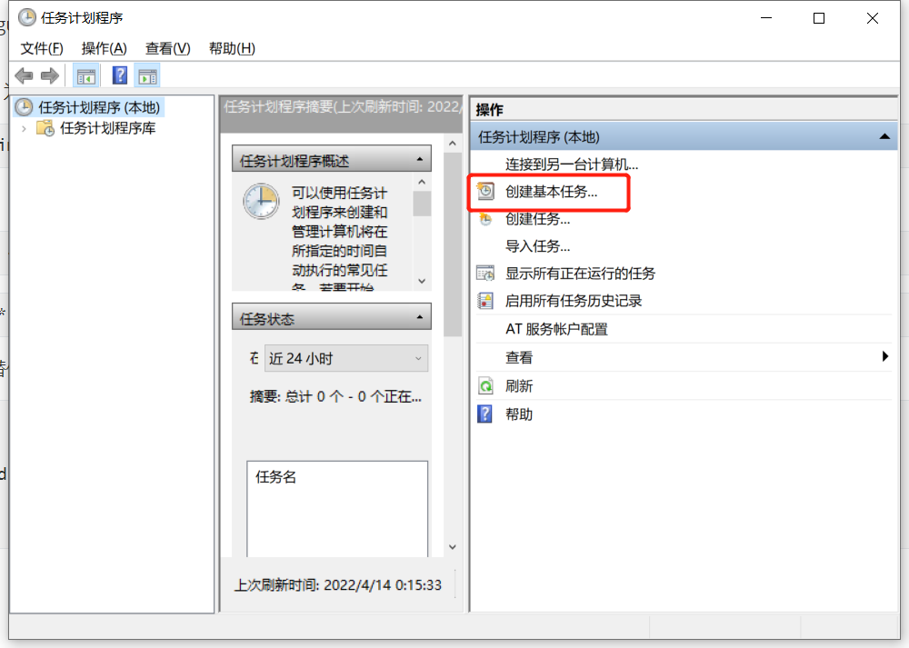
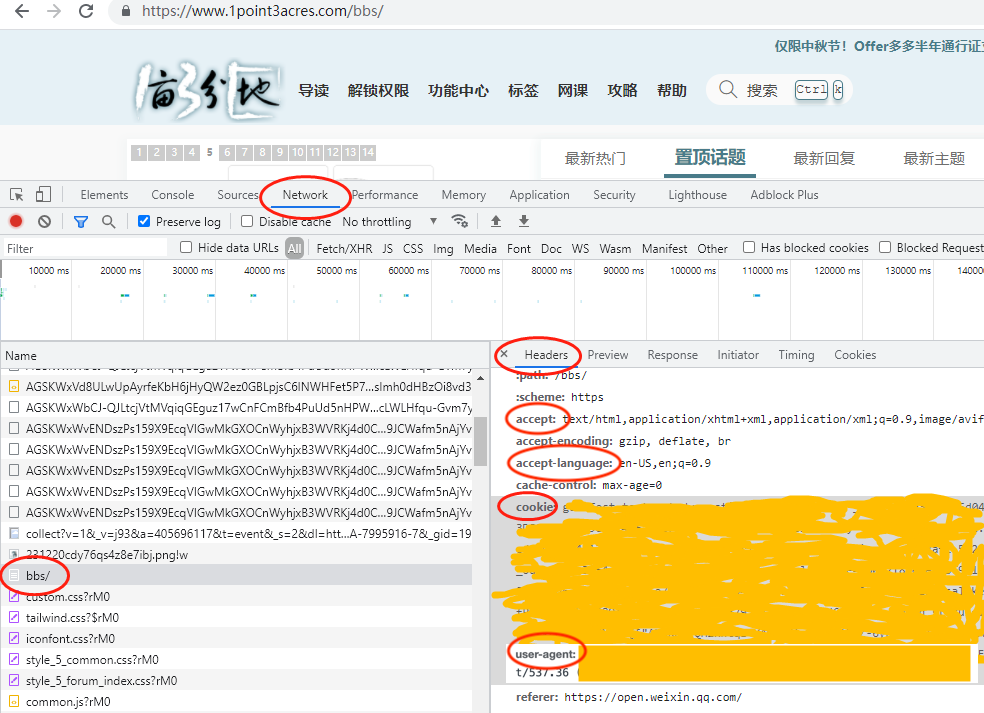

# 1point3acres

[一亩三分地](https://www.1point3acres.com/bbs/) 自动签到、答题

快速设置，无 aws 依赖，验证码自动识别，一次性设置后再无需手动操作

* 程序会自动识别验证码

* 程序会在指定的时间每天运行一次，一次配置，永远执行，设好后就再不用管

* 支持多用户签到，批量用户签到，把用户名密码加到`USERS`数组中即可

## how to use

### crontab 定时运行

* 注册[2captcha.com](https://2captcha.com?from=12332166) 得到 apikey 并充值(可以用支付宝)
    <details>
    <summary>具体操作展开查看</summary>
    
    
    </details>
* 修改 configure/data.json，用你的用户名,密码,apikey替换文件中的相应字段

* 安装依赖
  以 ubuntu 为例，其他系统请用相应的方式安装依赖
    ```bash
    sudo /bin/bash prepare.sh
    ```
  
* crontab
    ```
    crontab -e
    ```
    ```text
    15 8 * * * cd /replace_with_path_to_repo/src && python3 service.py 2>&1 1>/tmp/1point3acres.log
    ```
    
* windows替代crontab方法
    
    将"auto_run_windows.bat"中D:"替换为你的盘，"D:\replace_with_path_to_repo"路径替换为你的仓库路径 "。
    
    ```bat
    #auto_run_windows.bat
    D:
    cd D:\replace_with_path_to_repo\1point3acres\src
    python service.py 
    pause
    exit
    ```
    
    **创建定时任务**
    
    ```text
    win+R
    输入 
    taskschd.msc
    ```
    
    以此点击“创建基本任务"->"名称"一栏输入"1potins"->下一步->勾选"每天"->自己选择启动时间->下一步->操作选择“启动程序”->点击游览找到目录下的“auto_run_windows.bat”->点击下一步->点击完成。
    
    


## Notice
**只能微信扫码登录**

这段时间逐渐有账户被要求强制微信扫码登录, 导致程序失效。

增加了直接用cookie签到和答题的方式, 需要修改配置文件configure/cookie.json，把已登录的浏览器复制的cookie 粘贴到这个文件，api key和以前一样也需要替换。

使用cookie.json 后，原先的data.json 就用不到了，所以不再需要配置。

<details>
<summary> 如何找到cookie， F12 打开浏览器 console -> network 标签 -> 找到 bbs/ 请求 -> 查看具体的请求头 -> 找到cookie -> 复制cookie 后面的内容 </summary>


</details>

2021.09.22

<br>

**为登录增加验证码**

由于 昨天(2021.08.25) 网站为登录页面（弹窗）增加了验证码，所以代码也需要做相应的修改。

修改后，每天每用户需要调用 **3次** 验证码 API(登录一次，签到一次，答题一次)，

2captcha.com 充值 **3刀** 的可用天数缩减到 **300天**

2021.08.26

<br>

**更新验证模块**

使用 [网站 2captcha.com](https://2captcha.com?from=12332166) 提供的api。

但是该API 收费，一亩三分地的验证码是 [reCAPTCHA v2 hard](https://2captcha.com/demo) ，对应的[收费](https://2captcha.com/2captcha-api)是 $2.99 / 1000 次请求

如果想使用需要注册账号+充值只少3刀（单个账号可以用 500 天左右）+ 复制 apikey 替换 configure/data.json 文件中的字段

2021.08.01

<br>

**程序失效**

论坛增加了google Google reCAPTCHA 验证码，导致程序失效

部分账号被封号

2021.07.30

<br>

**Github Action 模式下** `get credit with flaresolverr` **这个workflow 有一定概率成功**

目前我试了三次只有一次是成功的。如果想尝试可以拉下最新代码

2021.07.13

<br>

**尝试了很多方法都行不通，宣布失败**

但由于 cloudflare 是根据 IP 来阻挡的，所以这个程序依然可以在本地运行 

2021.07.13

<br>

**目前遇到 被 cloudflare 阻挡的问题，还在修复中，修复后会更新**

2021.07.11

---


## 其他

* 题目数据来自： https://github.com/eagleoflqj/p1a3_script

