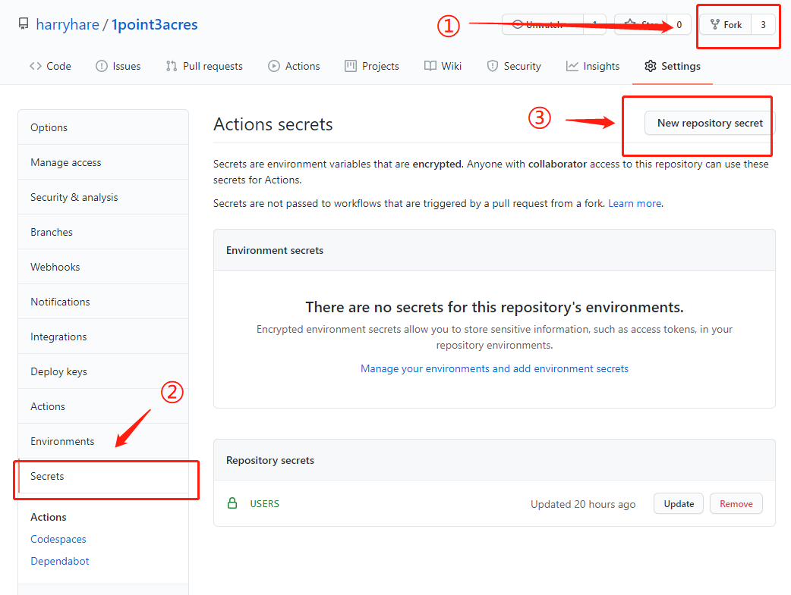
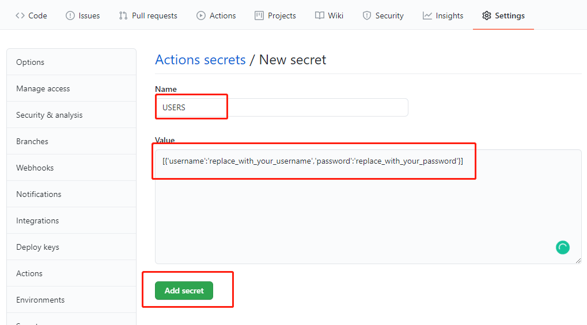
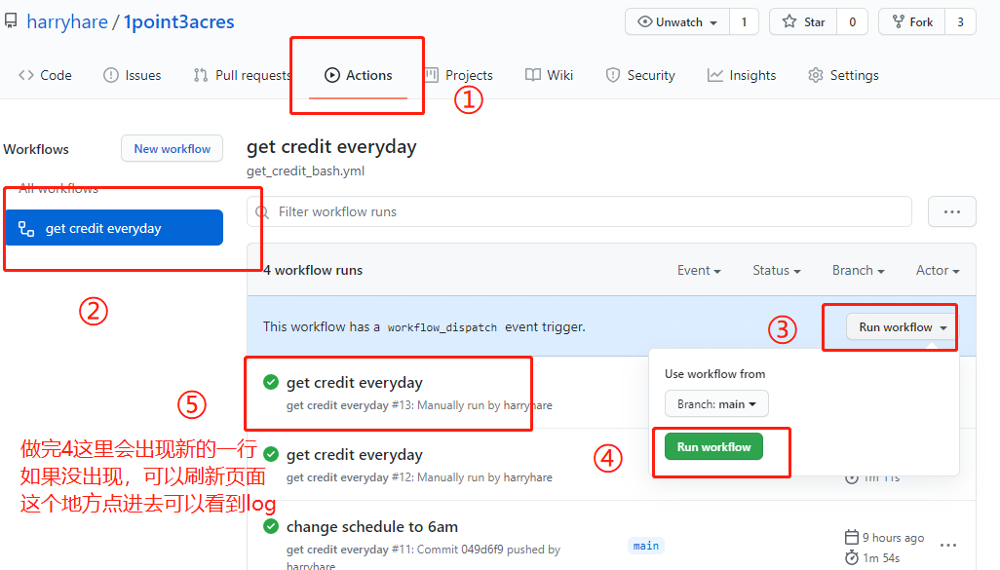
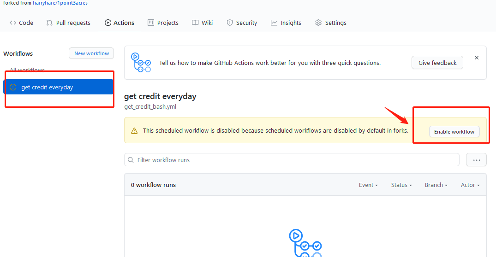
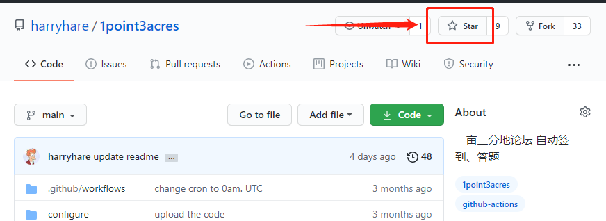

# 1point3acres

[一亩三分地](https://www.1point3acres.com/bbs/) 自动签到、答题

一分钟快速设置，无 aws 依赖，验证码自动识别，一次性设置后再无需手动操作

* 程序会自动识别验证码

* 程序会在指定的时间每天运行一次，一次配置，永远执行，设好后就再不用管

* 配置简单，一分钟搞定，使用 github action 模式，不依赖 github 以外的东西，只要 fork 本repo后设置 repo secret 即可

* 支持多用户签到，批量用户签到，把用户名密码加到`USERS`数组中即可

## how to use

下面几种执行模式任选一种即可。


### github action 模式（推荐）

* fork 这个repo

* 增加一个 repo secret: `USERS`, 格式如下，需代入你的用户名密码，
    ```text
    [{'username':'replace_with_your_username','password':'replace_with_your_password'}]
    ```
    用户名一般是邮箱，就是你登录的时候填的那个东东
    <details>
    <summary>具体操作展开查看</summary>
    
    
    ---
    
    </details>
* enable github action
    <details>
    <summary>具体操作展开查看</summary>
    
    
    ---
    
    </details>

* 做完上面的步骤，就完成了所有操作，github 会在每天的 北京时间9:00.am（UTC 1:00am.） 左右自动执行签到和答题程序。

  如果你想验证下用户名密码是否设置正确，可以到 git action 页面手动执行， 查看log中是否有"签到成功"
  
  如果已经答题或者已经签到，会显示"已答题" 或者 "已签到"，同样表示设置已成功。
  
  github 每天自动执行的log 也可以在这里看到。
  
    <details>
    <summary>具体操作展开查看</summary>
  
    
    ---
    
    </details>

* 好用请给个星
  

### github action with docker 模式

* 随便选（建）一个github repo

* 创建 一个 repo secret ： `USERS`, 格式如下，需代入你的用户名密码

    ```text
    [{'username':'replace_with_your_username','password':'replace_with_your_password'}]
    ```
    
* 创建 workflow

	```yaml
    name: 1point3acre get credits with docker
    on:
      workflow_dispatch:
      schedule:
        - cron: '30 0 * * *'
    jobs:
      _1point3acres:
        runs-on: ubuntu-latest
        name: get credits
        steps:
        - name: run docker
          id: checkin
          uses: harryhare/1point3acres@main
          with:
            users: ${{ secrets.USERS }}
        - name: get the result
          run: echo "${{ steps.checkin.outputs.result }}"
	```


### AWS-lambda 模式

* 修改 configure/data.json，用你的用户名密码替换文件中的相应字段
* aws 创建 docker registry, 修改 makefile 的 image 地址
* 根据 aws 提示，docker login，然后 make build && make push
* aws 创建 lambda，选择第一步创建的 image，设置trigger


### crontab 模式

* 修改 configure/data.json，用你的用户名密码替换文件中的相应字段

* 安装依赖
以 ubuntu 为例，其他系统请用相应的方式安装依赖
    ```bash
    sudo /bin/bash prepare.sh
    ```
    
* crontab
    ```
    crontab -e
    ```
    ```text
    15 0 * * * python3 /replace_with_path_to_repo/service.py 2>&1 1>/dev/null
    ```

## 其他

* 题目数据来自： https://github.com/eagleoflqj/p1a3_script